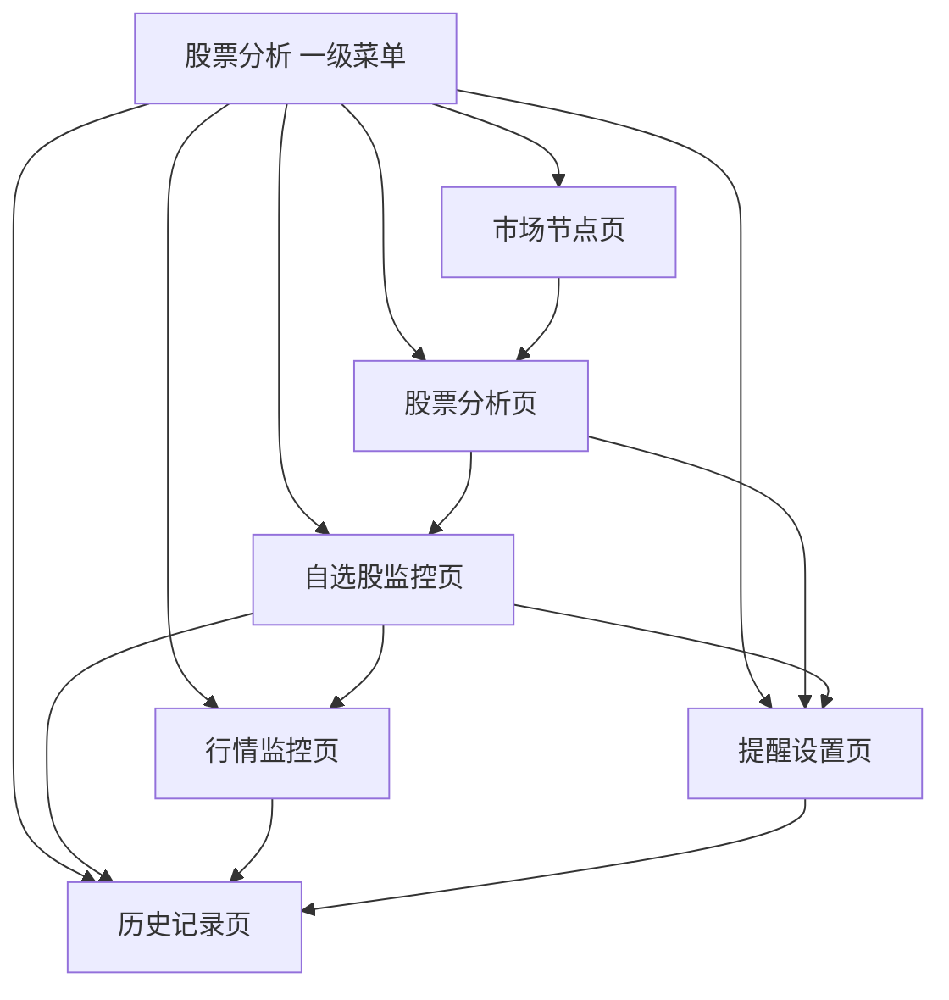
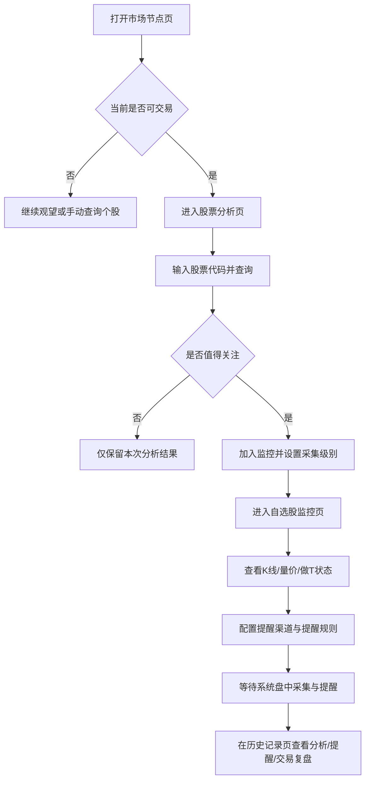
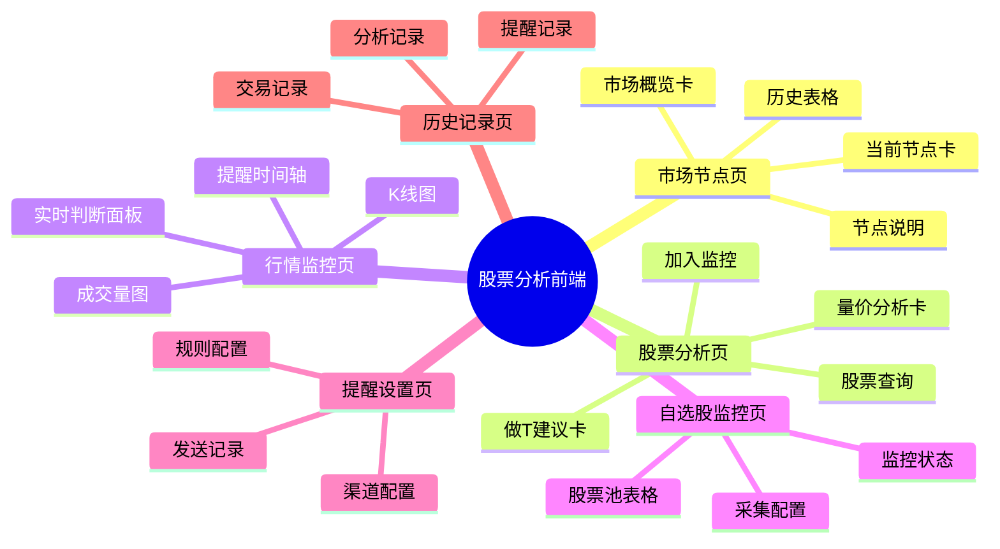

# 股票分析与提醒系统设计规格

## 1. 文档目标

本文档用于定义一套可直接落地在当前 `ruoyi-vue-pro / yudao` 仓库中的股票分析与提醒系统第一期设计方案。目标是将以下三套交易认知完整融合为统一的规则引擎与管理端能力：

1. 《六个出手节点》
2. 《看懂量价 了解趋势》
3. 《不怕跌停的三步循环做T》

系统定位为：

1. 面向多用户的股票分析与提醒后台系统。
2. 基于现有若依前后端分离思想和当前仓库真实技术栈实现。
3. 第一阶段先交付“可运行闭环”，包括识别、分析、做T建议、提醒、可视化、记录与配置。

## 2. 基座与现实约束

### 2.1 当前仓库真实基座

当前代码库不是传统 `RuoYi-Vue Vue2 + Element UI` 标准分离版，而是：

1. 后端：`Spring Boot 2.7.x + Yudao/RuoYi-Vue-Pro` 多模块结构。
2. 前端：`Vue 3 + TypeScript + Element Plus + Vite`。
3. 权限、菜单、字典、日志、定时任务、Redis、MyBatis 已具备成熟基座。

### 2.2 本设计的落地原则

为保证“设计可直接实施”，本系统采用以下落地策略：

1. 后端沿用当前多模块架构，新增独立模块 `yudao-module-stock`。
2. 前端沿用当前管理端技术栈，在现有前端中新增 `stock` 业务目录。
3. 保持若依式前后端分离思想，但不另起 Vue2 前端壳。
4. 所有规则引擎统一沉淀在后端，前端只负责配置、查询、展示与确认。

### 2.3 为什么不按 Vue2 另起一套

如果另起一套 Vue2 项目：

1. 与当前仓库无法形成“可直接导入 IDE 运行”的单仓交付。
2. 菜单、权限、接口、部署会出现两套维护面。
3. 第一阶段重点会被前端迁移成本稀释，不利于尽快验证交易规则本身。

因此，本设计以“当前仓库可跑通”为第一原则。

## 3. 业务目标

系统要解决的问题不是“预测股票必涨”，而是把三套规则固化为一套可复用的辅助决策系统。

### 3.1 核心目标

1. 识别市场是否处于可交易时间窗。
2. 在可交易时间窗内筛选量价合格标的。
3. 对合格标的计算做T价位、仓位建议与形态失效边界。
4. 在触发节点时主动提醒，而不是靠人工盯盘。
5. 把每次识别、提醒、建议、手工交易记录下来，便于复盘。

### 3.2 第一阶段成功标准

1. 用户可以配置股票池与提醒参数。
2. 系统可以按盘中定时轮询方式生成市场节点判断。
3. 系统可以对指定股票输出量价分析与做T建议。
4. 系统可以通过站内消息和 WxPusher 发送提醒。
5. 前端可以查看节点、图表、分析结果、提醒记录、交易记录。

## 4. 规则融合总纲

系统内部所有建议必须遵循以下三步过滤逻辑：

1. **先看市场节点**：六大节点未触发时，原则上不生成进场建议。
2. **再看量价关系**：节点触发后，仅保留量价结构合格的标的。
3. **最后看做T结构**：只有低位横盘、结构稳定、三重底有效的个股才进入做T建议。

这三步是硬门槛，不允许绕过。

## 5. 三套规则的系统化定义

## 5.1 六个出手节点规则

系统定义六类市场节点，每类节点都由“基础条件 + 增强条件 + 风险提示”组成。

### 5.1.1 增量共振点

含义：市场有效放量，指数、成交量、题材同步走强，新行情启动。

建议识别维度：

1. 大盘指数涨幅达到阈值。
2. 市场总成交额相较前一交易日明显放大。
3. 涨停家数、连板家数、题材热度同步提升。
4. 至少一个核心板块形成联动。

输出语义：

1. 节点名称：增量共振点
2. 操作建议：允许进场，优先关注最强题材核心股
3. 风险提示：若共振仅由单一权重股推动，则信号降级

### 5.1.2 题材发酵点

含义：指数稳定，板块内批量涨停，赚钱效应集中，题材获得市场确认。

建议识别维度：

1. 指数波动稳定或温和上行。
2. 某板块涨停家数达到阈值。
3. 板块内部首板、二板、趋势股同时活跃。
4. 板块成交额与搜索热度明显提升。

输出语义：

1. 节点名称：题材发酵点
2. 操作建议：聚焦板块内辨识度高、量价结构好的个股
3. 风险提示：仅有尾盘情绪点火且无持续性时不视为有效发酵

### 5.1.3 主线第一次分歧点

含义：强题材形成主线后首次出现分化回调，是低吸核心股窗口。

建议识别维度：

1. 题材前期连续强势。
2. 龙头未彻底走坏，但后排明显掉队。
3. 高位跟风股出现较多亏钱效应。
4. 板块内部核心股承接仍强。

输出语义：

1. 节点名称：主线第一次分歧点
2. 操作建议：只关注核心，不做后排补跌接力
3. 风险提示：若龙头失守关键结构，则分歧升级为退潮

### 5.1.4 分歧转一致点

含义：龙头带动板块重新走强，分歧后再形成合力，是右侧确认点。

建议识别维度：

1. 龙头率先转强。
2. 板块跟涨家数恢复。
3. 成交量重新放大。
4. 前一天分歧中幸存的核心股同步反包或新高。

输出语义：

1. 节点名称：分歧转一致点
2. 操作建议：允许右侧确认参与
3. 风险提示：若只有龙头单兵反抽，不视为真正一致

### 5.1.5 市场突破震荡点

含义：指数结束横盘并连续走强，风险偏好回升。

建议识别维度：

1. 指数脱离箱体上沿。
2. 成交额持续回升。
3. 上涨家数明显占优。
4. 高弹性板块开始活跃。

输出语义：

1. 节点名称：市场突破震荡点
2. 操作建议：跟随最强题材，不逆势做弱股
3. 风险提示：假突破且缩量时，信号降级

### 5.1.6 情绪冰点修复点

含义：跌停减少、涨停增加、亏钱效应止跌修复，适合小仓试错。

建议识别维度：

1. 跌停家数下降。
2. 涨停家数上升。
3. 连板修复率改善。
4. 大面股数量明显减少。

输出语义：

1. 节点名称：情绪冰点修复点
2. 操作建议：仅限小仓试错，不做重仓梭哈
3. 风险提示：修复失败时要立即回到防守

## 5.2 量价分析规则

量价分析必须结合“位置”来解释，不能只输出形态名词。

### 5.2.1 量增价涨

系统要区分三种语义：

1. 低位：启动信号，可视为主力建仓或趋势初启。
2. 中位：趋势延续，可持有或回踩低吸。
3. 高位：资金分歧，警惕冲高回落与顶部派发。

### 5.2.2 价涨量缩

系统要区分普通警示和特殊例外：

1. 常规解释：筹码惜售但跟风不足，不建议追高。
2. 低位中途缩量：若仍在低位趋势中，可解释为良性锁仓。
3. 高位连续缩量涨停：视为高风险随时开板，不给追高建议。

### 5.2.3 价跌量增

系统定义为风险释放或出货迹象：

1. 普通下跌放量：空头发力，谨慎观望。
2. 高位放量大跌：优先判定为主力出货，输出止损或回避建议。

### 5.2.4 输出结构

量价分析结果至少包含：

1. 量价类型
2. 股价位置
3. 操作建议
4. 原因说明
5. 风险等级

## 5.3 三步循环做T规则

### 5.3.1 使用前提

系统只有在以下条件同时满足时，才允许输出“适合做T”：

1. 个股处于低位横盘或低位抬升结构。
2. 波动存在规律，不是高位乱冲。
3. 基本面没有明显恶化。
4. 趋势未失控，关键支撑未破坏。

### 5.3.2 三重底确认

系统识别三重底时，需要满足：

1. 至少三个低点。
2. 低点逐次抬高或误差在可接受区间内。
3. 底部区间有成交量配合。
4. 第三个低点后出现确认性反弹或站稳信号。

### 5.3.3 买入逻辑

当三重底确认后，系统输出：

1. 建议买入区间
2. 支撑位
3. 建议加仓比例
4. 前提说明：计划加仓，不允许情绪化满仓

### 5.3.4 卖出逻辑

当反弹到压力区时，系统输出：

1. 压力位
2. 建议卖出区间
3. 卖出顺序说明：优先卖老仓，保留新仓
4. 降本后持仓成本估算

### 5.3.5 停止条件

任一结构失效时，系统必须停止继续给出做T建议：

1. 跌破关键支撑
2. 三重底结构失真
3. 高位乱冲并伴随大分歧
4. 波动空间不足以覆盖成本

## 6. 系统总体架构

## 6.1 架构原则

1. 规则引擎集中在后端。
2. 数据源可替换。
3. 多用户配置隔离。
4. 结果可缓存、可回放、可追踪。
5. 与现有若依权限、日志、定时任务体系兼容。

## 6.2 后端模块结构

新增 Maven 模块：

`yudao-module-stock`

模块内部目录遵循现有项目结构：

1. `api`
2. `controller`
3. `convert`
4. `dal`
5. `enums`
6. `job`
7. `service`
8. `framework` 仅在确有模块内扩展点时新增，禁止碰通用框架核心

## 6.3 前端目录结构

前端新增：

1. `src/api/stock/**`
2. `src/views/stock/**`
3. 需要复用的股票业务组件可放 `src/components/stock/**`

## 6.4 领域划分

第一期拆为七个子域：

1. `market-data`：行情拉取、缓存、归一化
2. `market-signal`：六大节点识别
3. `stock-analyzer`：量价分析
4. `t-strategy`：三重底与做T价位计算
5. `alert`：提醒规则与发送
6. `watchlist`：股票池与用户配置
7. `trade-journal`：建议记录与交易复盘

## 7. 数据源设计

## 7.1 第一阶段数据源策略

第一阶段默认直接接入真实数据源，不采用“生产长期依赖 Mock/CSV”的方案。

生产链路要求如下：

1. 盘中识别、量价分析、做T判断、提醒发送，全部基于真实数据源执行。
2. Mock 数据仅用于单元测试、联调测试、测试样例复现。
3. CSV/Excel 导入仅作为历史补数、测试样例或异常排查辅助工具，不作为生产主链路。
4. 所有正式业务判断都必须来自真实行情数据，而不是演示数据。

### 7.1.1 为什么第一阶段就直接接真实数据

1. 你的目标是实盘辅助系统，不是策略演示系统。
2. 六大节点、量价关系、做T价位都依赖真实市场状态，长期使用 Mock 没有业务意义。
3. 生产阶段如果不用真实源，提醒和监控页面都失去价值。
4. 因此第一阶段就必须打通真实数据抓取、规则识别和提醒闭环。

## 7.2 数据源抽象接口

建议抽象统一接口，例如：

1. 获取市场总览
2. 获取板块概览
3. 获取个股日线
4. 获取个股分时快照
5. 获取成交量数据
6. 获取涨停跌停统计

所有上游返回数据先归一化为项目内部 DTO，再进入规则引擎。

## 7.3 数据源选型建议

第一期数据源不建议写死成单一供应方，而是采用“主源 + 补充源 + 回填源 + 付费预留源”的分层设计。

### 7.3.1 推荐组合

#### 方案 A：推荐落地组合

1. **主源：Tushare HTTP**
2. **补充源：AKShare HTTP（AKTools）**
3. **历史回填源：BaoStock**
4. **测试与兜底源：Mock/CSV 导入**

这是当前最适合本项目的组合，原因如下：

1. 当前后端是 Java，`RestTemplate`/HTTP 对接成本最低。
2. Tushare 官方明确支持 HTTP 获取和 Restful API 设计，天然适合 Java 调用。
3. Tushare 存在从免费起步到付费升级的平滑路径，后续不需要重构整体接入层。
4. AKShare 已提供 HTTP 版本 `AKTools`，适合作为补充型免费数据源。
5. BaoStock 适合做历史 K 线补数和离线导入，但不建议作为第一主源承担全部盘中链路。
6. Mock/CSV 只保留给测试和兜底，不作为正式生产数据方案。

### 7.3.1.1 数据源免费/付费一览

以下结论基于各官方文档当前公开说明整理，适合直接作为选型判断。

#### 免费优先

1. **Tushare HTTP：免费起步，可升级付费**
2. **AKShare HTTP（AKTools）：免费 / 开源**
3. **BaoStock：免费 / 开源**
4. **Mock / CSV 导入：免费，自建**

#### 付费预留

1. **Tushare Pro 高积分 / 高权限：付费升级**
2. **聚宽 JQData：试用申请或付费购买**
3. **Wind / iFinD 等企业数据源：企业级付费**

#### 直白结论

1. 如果你现在想 **先用真实数据免费跑起来**，优先用 `Tushare 免费 token + AKShare + BaoStock`。
2. 如果你后面想 **平滑升级而不重构**，优先把 `Tushare` 设计成主源。
3. 如果你后面想 **做更重的量化研究和更高质量数据服务**，预留 `JQData` 和企业级 Provider 接口。
4. Mock/CSV 不作为正式生产模式，只是测试与兜底工具。

### 7.3.2 免费源推荐顺序

#### 第一推荐：Tushare HTTP

推荐原因：

1. 官方说明支持 `Restful HTTP`，适合 Java 直连。
2. 官方公开说明注册后可先获得基础积分，适合免费起步验证。
3. 后续如果数据频次和权限不够，可以直接升级为付费版本，不需要重写核心接口。

适合承担的数据职责：

1. 个股日线
2. 基础行情
3. 交易日历
4. 部分市场统计
5. 用户后续可能需要的更多结构化数据

风险与限制：

1. 免费阶段权限和频次有限。
2. 某些分钟级、特色数据需要单独权限或更高积分。
3. 官方公开的积分与频次表显示：
   - `120 积分` 档价格为 `0 元/年`
   - `2000 / 5000 / 10000 / 15000` 等更高档位为付费年费
4. 因此它不是“纯免费到底”的源，而是“免费起步、后续可付费扩容”的源。

#### 第二推荐：AKShare HTTP（AKTools）

推荐原因：

1. AKShare 官方已经提供 HTTP 部署方案 `AKTools`。
2. 数据覆盖广，适合作为市场总貌、指数、板块、补充行情的拓展源。
3. 对于一些公共站点公开数据，AKShare 整理能力较强。

适合承担的数据职责：

1. 市场总貌
2. 指数与板块补充数据
3. 宏观与衍生补充数据
4. 当主源某类字段缺失时的补足

风险与限制：

1. 官方明确提示其数据主要用于研究用途。
2. 某些接口底层依赖公开网站，稳定性可能受外部站点影响。
3. 更适合作为补充源，而不是第一主交易链路。
4. 官方定位是开源数据接口库与 HTTP 部署能力，本身不是按年费售卖的数据服务。

#### 第三推荐：BaoStock

推荐原因：

1. 官方提供免费历史交易数据能力。
2. 日 K、周 K、月 K、分钟 K 较适合做历史结构识别与回填。

适合承担的数据职责：

1. 历史 K 线回填
2. 离线分析样本
3. 做T结构识别的补历史数据

风险与限制：

1. 官方能力更偏 Python API。
2. 不适合作为当前 Java 后端盘中主链路直连首选。
3. 更适合作为导入任务或边车服务的数据来源。
4. 官方知识库公开说明其为“免费、开源”的证券数据平台。

### 7.3.3 付费源预留建议

第一阶段必须在接口层预留以下付费数据源的可插拔位置。

#### 第一优先付费升级：Tushare Pro

推荐原因：

1. 和免费起步源同源，升级成本最低。
2. 官方已经给出不同积分和频次档位，付费路径明确。
3. 保留同一套请求模型和认证模型即可平滑升级。

适合后续增强的能力：

1. 更高频次
2. 更丰富分钟数据
3. 更完整特色数据
4. 更大规模股票池轮询

#### 第二优先付费预留：聚宽 JQData

推荐原因：

1. 官方提供 API 文档和数据接口体系。
2. 后续如果要增强研究、回测和更完整量化数据，JQData 是现实可用的升级路径。
3. 官方使用说明明确写有“试用申请、付费购买”两种授权方式，属于应按付费数据源预留的接口类型。

适合后续增强的能力：

1. 更强研究数据
2. 更细颗粒度量化分析
3. 回测与策略扩展对接

#### 企业级预留：Wind / iFinD 等

第一期无需接入，但架构上要允许以后新增企业级 Provider。

### 7.3.4 推荐实施策略

第一期建议按以下顺序实现：

1. `tushare-http-provider`：真实数据免费起步主源
2. `aktools-http-provider`：真实数据免费补充源
3. `baostock-import-provider`：真实历史数据回填源
4. `tushare-pro-provider`：后续付费升级源
5. `jqdata-provider`：后续量化增强源
6. `mock-csv-provider`：仅用于测试、联调、异常兜底

### 7.3.5 数据源切换配置建议

建议预留配置项，例如：

1. `stock.data.provider.primary`
2. `stock.data.provider.secondary`
3. `stock.data.provider.backfill`
4. `stock.data.provider.failover-enabled`
5. `stock.data.provider.timeout-ms`
6. `stock.data.provider.auth.*`

这样后续新增或切换数据源时，不需要修改规则引擎主体。

### 7.3.5.1 生产 / 测试 / 兜底模式说明

建议在文档和配置中明确区分三种模式：

1. `production`
说明：只允许使用真实数据源，主源失败时可切补源或缓存，不允许切到 Mock 继续给业务用户出正式建议。

2. `test`
说明：允许使用 Mock/CSV 跑单元测试、接口测试、页面联调和样例演示。

3. `degraded`
说明：生产真实源异常时，允许使用最近真实缓存或补源结果做有限展示；Mock 仅供研发排障，不对正式业务用户开放。

### 7.3.6 数据源能力分层

建议把数据能力拆成独立能力接口，而不是一个巨大 Provider 包打天下。

建议拆分为：

1. `TradeCalendarProvider`
2. `MarketOverviewProvider`
3. `IndexQuoteProvider`
4. `StockQuoteProvider`
5. `KlineProvider`
6. `ThemeBoardProvider`
7. `LimitStatisticProvider`

一个数据源可以实现其中一个或多个能力接口。这样即使未来某个付费源只负责分钟线，另一个源只负责板块热度，也能自然组合。

### 7.3.7 官方参考资料

以下是本设计当前参考的官方资料：

1. AKShare 项目概览：https://akshare.akfamily.xyz/introduction.html
2. AKShare HTTP 部署：https://akshare.akfamily.xyz/deploy_http.html
3. BaoStock 官网：https://www.baostock.com/
4. BaoStock 知识库：https://www.baostock.com/helpDocsHome
5. Tushare 数据获取方式：https://tushare.pro/document/1?doc_id=129
6. Tushare 积分与频次说明：https://tushare.pro/document/1?doc_id=290
7. 聚宽 API 文档：https://www.joinquant.com/help/api/help

## 8. 定时任务与运行流程

## 8.1 时效要求

第一期采用盘中轮询模式，建议默认：

1. 交易时段 1 到 5 分钟执行一次
2. 非交易时段不执行盘中分析
3. 收盘后可补跑一次日终归档分析

补充要求：

1. 盘中轮询默认使用真实数据源。
2. 不允许在生产模式下使用 Mock 数据驱动节点判断和提醒。
3. 若主源失败，优先切换补源或使用最近一次真实缓存结果，并显式标记数据时间。

## 8.2 调度链路

每次任务执行分五步：

1. 拉取市场整体数据
2. 识别六大节点
3. 遍历启用监控的股票池并执行量价分析
4. 对满足前置条件的个股执行做T分析
5. 按用户规则生成提醒并持久化记录

补充说明：

1. 第一阶段默认采用“市场总览 + 用户关注股票池定向采集”的模式。
2. 不要求对全市场所有股票进行高频细粒度采集。
3. 用户未登记到股票池的个股，只在手动查询时即时拉取，不进入持续轮询监控。
4. 用户已登记且启用监控的个股，才进入专门采集、分析、提醒和记录闭环。

## 8.3 Redis 缓存策略

Redis 用于：

1. 缓存最新市场快照
2. 缓存最新个股分析结果
3. 缓存用户最近一次提醒，避免重复轰炸
4. 缓存图表查询热点数据

## 9. 数据模型设计

以下为第一期建议数据表。

## 9.1 市场与行情表

### 9.1.1 `stock_market_snapshot`

用途：存储某次市场轮询的整体快照。

建议字段：

1. `id`
2. `trade_date`
3. `snapshot_time`
4. `index_code`
5. `index_name`
6. `index_price`
7. `index_change_percent`
8. `market_turnover`
9. `up_count`
10. `down_count`
11. `limit_up_count`
12. `limit_down_count`
13. `theme_hot_json`
14. `data_source`

### 9.1.2 `stock_kline_daily`

用途：存储个股日线与成交量序列。

建议字段：

1. `id`
2. `stock_code`
3. `stock_name`
4. `trade_date`
5. `open_price`
6. `close_price`
7. `high_price`
8. `low_price`
9. `volume`
10. `amount`
11. `turnover_rate`
12. `data_source`

### 9.1.3 `stock_kline_intraday_snapshot`

用途：存储盘中快照，支撑实时提醒与图表。

## 9.2 配置与股票池表

### 9.2.1 `stock_watchlist`

用途：用户自选股与监控开关。

建议字段：

1. `id`
2. `user_id`
3. `stock_code`
4. `stock_name`
5. `enabled`
6. `remark`

建议扩展字段：

1. `collect_level`
2. `collect_interval_minutes`
3. `need_intraday_kline`
4. `need_board_analysis`
5. `need_t_strategy`
6. `need_price_alert`
7. `need_signal_alert`
8. `last_collect_time`

字段语义：

1. `collect_level`
说明：采集强度等级，建议取值 `NORMAL / KEY / CORE`

2. `collect_interval_minutes`
说明：该股票的专门采集周期，例如 `1 / 3 / 5`

3. `need_intraday_kline`
说明：是否采集盘中分时或分钟级 K 线

4. `need_board_analysis`
说明：是否同时分析所属板块和题材联动

5. `need_t_strategy`
说明：是否对该股票启用三重底做T专门分析

6. `need_price_alert`
说明：是否启用价格触发提醒

7. `need_signal_alert`
说明：是否启用量价、节点、做T信号提醒

8. `last_collect_time`
说明：最近一次专门采集时间，用于调度排程与健康检查

### 9.2.1.1 关注股票专门采集机制

系统必须支持对用户关注的股票进行“专门采集、专门分析、专门登记”，而不是只保存一个股票代码列表。

专门采集的目标包括：

1. 对重点股票定期抓取最新价格、涨跌幅、成交量、成交额
2. 对重点股票抓取日 K 与必要的分钟级数据
3. 对重点股票执行量价分析和做T分析
4. 对重点股票记录每次分析结果、提醒结果和结构变化
5. 对重点股票保留最近一次有效建议与触发原因

系统应支持按关注级别差异化采集：

1. `NORMAL`
说明：普通关注，只做基础行情与低频轮询

2. `KEY`
说明：重点关注，增加盘中细粒度分析与提醒

3. `CORE`
说明：核心关注，优先级最高，可启用更短轮询周期和完整做T链路

建议调度策略：

1. `NORMAL`：5 分钟轮询一次
2. `KEY`：3 分钟轮询一次
3. `CORE`：1 分钟轮询一次

这样可以控制采集成本，同时把计算资源集中在你真正关注的股票上。

### 9.2.1.2 手动登记与自动登记

关注股票的登记方式建议同时支持两种：

1. 手动登记
说明：用户主动输入股票代码加入股票池

2. 自动登记
说明：当用户在分析页主动查询某只股票并选择“加入监控”时，自动写入股票池

这样既支持主动维护，也支持边分析边沉淀。

### 9.2.1.3 专门登记的结果沉淀

对关注股票的专门采集，不只登记股票本身，还要登记采集和分析结果：

1. 最近一次采集时间
2. 最近一次量价分析结论
3. 最近一次做T结论
4. 最近一次提醒发送结果
5. 最近一次结构失效时间
6. 最近一次建议动作

这些信息可以用于前端监控列表快速展示，无需每次都重新全量计算。

### 9.2.1.4 可选拆表方案

如果后续关注股票维度的字段越来越多，建议从 `stock_watchlist` 中进一步拆出：

1. `stock_watch_collect_config`
2. `stock_watch_runtime_state`

第一期为了控制复杂度，可以先保留在 `stock_watchlist` 或一个附属配置表中；第二期若需要更高并发和更复杂调度，再做拆分。

### 9.2.2 `stock_analysis_config`

用途：用户个性化参数配置。

建议字段：

1. `id`
2. `user_id`
3. `config_name`
4. `market_signal_threshold_json`
5. `volume_price_threshold_json`
6. `t_strategy_threshold_json`
7. `default_position_ratio`
8. `enabled`

## 9.3 分析结果表

### 9.3.1 `stock_market_signal_record`

用途：记录每次市场节点识别结果。

### 9.3.2 `stock_analysis_record`

用途：记录个股量价分析结果。

建议字段包含：

1. `signal_type`
2. `position_type`
3. `advice_type`
4. `reason_text`
5. `risk_level`
6. `analysis_time`

补充要求：

1. 必须记录该分析是否来自“关注股票专门采集”还是“临时手动查询”
2. 建议增加 `from_watchlist`、`watchlist_id`、`collect_level` 等字段
3. 这样后续复盘时可以区分哪些记录是监控链路产生，哪些是人工查询产生

### 9.3.3 `stock_t_strategy_record`

用途：记录做T判断结果。

建议字段包含：

1. `is_t_applicable`
2. `support_price`
3. `buy_price_range`
4. `pressure_price`
5. `sell_price_range`
6. `position_ratio`
7. `invalid_condition_text`
8. `analysis_time`

补充要求：

1. 必须能关联到具体的关注股票配置
2. 建议记录 `watchlist_id`
3. 建议记录 `support_source` 和 `pressure_source`
4. 便于解释该价位来自三重底、均线支撑还是前高压力

## 9.4 提醒与复盘表

### 9.4.1 `stock_alert_channel`

用途：用户提醒渠道配置。

支持类型：

1. 站内信
2. WxPusher
3. 邮件
4. 短信，第一期先预留结构

### 9.4.2 `stock_alert_rule`

用途：提醒规则配置。

### 9.4.3 `stock_alert_record`

用途：每次实际推送记录。

补充要求：

1. 必须记录该提醒是否针对关注股票触发
2. 建议记录 `watchlist_id`
3. 建议记录 `trigger_type`
4. 建议记录 `trigger_snapshot_json`

### 9.4.4 `stock_trade_journal`

用途：记录用户手工买卖、收益和复盘说明。

## 10. 后端服务设计

## 10.1 MarketDataService

职责：

1. 对接数据源
2. 拉取市场和个股数据
3. 归一化 DTO
4. 写缓存与必要落库

## 10.2 MarketSignalService

职责：

1. 六大节点识别
2. 节点结果分级
3. 触发理由生成
4. 风险等级输出

## 10.3 VolumePriceAnalyzerService

职责：

1. 识别量价关系
2. 判定高低位
3. 生成操作建议与原因文本

## 10.4 TStrategyService

职责：

1. 识别三重底
2. 计算支撑位与压力位
3. 输出买卖区间、仓位建议、失效条件

## 10.5 StockDecisionService

职责：

1. 把市场节点、量价分析、做T分析统一编排
2. 输出最终综合建议
3. 控制“三步过滤”硬规则

## 10.6 AlertService

职责：

1. 根据分析结果匹配提醒规则
2. 防重复推送
3. 调用站内信、WxPusher、邮件等发送器

## 10.7 扩展架构设计

本系统从第一阶段开始就要按“后续继续加方法、加数据源、加提醒渠道”的方式设计，不能把当前三套规则写成不可维护的硬编码。

### 10.7.1 扩展目标

后续要允许低成本扩展以下能力：

1. 新的数据源
2. 新的市场节点识别方法
3. 新的量价解释模型
4. 新的做T模型
5. 新的综合评分法
6. 新的提醒渠道
7. 新的回测与研究能力

### 10.7.2 核心扩展接口

建议在 `yudao-module-stock` 内部定义以下扩展接口。

#### 一、数据源扩展接口

1. `StockDataProvider`
2. `TradeCalendarProvider`
3. `MarketOverviewProvider`
4. `IndexQuoteProvider`
5. `StockQuoteProvider`
6. `KlineProvider`
7. `ThemeBoardProvider`
8. `LimitStatisticProvider`

作用：

1. 把行情获取能力按职责拆开。
2. 支持不同 Provider 组合装配。
3. 支持主源失败时自动切补源。

#### 二、规则识别扩展接口

1. `MarketSignalRule`
2. `VolumePriceRule`
3. `TStrategyRule`
4. `RiskControlRule`

作用：

1. 新增任意一种战法时，不需要改 Controller。
2. 新规则只需实现对应接口并注册即可。
3. 旧规则和新规则可以并行比较与灰度启用。

#### 三、决策编排扩展接口

1. `DecisionStage`
2. `DecisionContext`
3. `DecisionResult`
4. `DecisionPipeline`

作用：

1. 将“市场过滤 -> 量价过滤 -> 做T计算 -> 风控过滤 -> 提醒判定”拆成流水线。
2. 以后加新的阶段，例如“新闻情绪过滤”“财报排雷过滤”，只需插入新的 Stage。

#### 四、提醒渠道扩展接口

1. `AlertChannel`
2. `AlertMessageBuilder`
3. `AlertThrottlePolicy`

作用：

1. 允许新增企业微信、钉钉、飞书、Telegram、短信等渠道。
2. 每个渠道只关心发送，不污染分析层。

#### 五、策略注册与选择接口

1. `StrategyDefinition`
2. `StrategyRegistry`
3. `StrategySelector`

作用：

1. 支持一个用户启用多种方法。
2. 支持按用户、按股票池、按场景选择不同策略组合。

### 10.7.3 推荐的扩展装配方式

扩展实现建议遵循 Spring 的可插拔装配方式：

1. 使用接口 + 多个实现类
2. 使用 `@Component` / `@Service` 注册
3. 通过 `@ConditionalOnProperty` 控制启停
4. 通过配置文件选择默认 Provider 或默认策略
5. 通过数据库配置决定用户侧启用哪些规则

### 10.7.4 新战法接入规范

后续如果你要新增一种方法，例如：

1. 均线多头排列
2. MACD 背离
3. 放量突破平台
4. 龙头回头
5. 涨停接力
6. 趋势跟随

接入方式建议统一为：

1. 定义策略元数据
2. 实现对应规则接口
3. 配置所需参数项
4. 注册到策略注册中心
5. 在前端策略配置页暴露开关和参数
6. 在决策流水线中选择启用阶段

这样不会污染现有三套核心逻辑。

### 10.7.5 新数据源接入规范

新增数据源时必须遵循以下步骤：

1. 明确该数据源支持哪些能力接口
2. 实现能力接口而不是修改规则服务
3. 增加统一 DTO 归一化层
4. 增加认证配置和健康检查
5. 增加源级别超时、重试、降级策略
6. 增加字段映射测试和样例数据测试

### 10.7.6 付费升级不重构原则

第一期所有数据接入都必须满足这个原则：

1. 免费源与付费源的切换只发生在 Provider 层
2. 规则引擎不感知数据来自免费还是付费
3. Controller、前端页面、数据库主结构不因为数据源升级而重写
4. 付费升级最多新增字段，不推翻原有模型

### 10.7.7 数据表预留建议

为支持后续扩展，建议在配置与记录表中预留以下通用字段：

1. `strategy_code`
2. `strategy_version`
3. `provider_code`
4. `provider_extra`
5. `rule_snapshot_json`
6. `feature_snapshot_json`

这样后续新增策略版本和新增数据源时，旧记录仍然可回放、可对账、可复盘。

### 10.7.8 前端扩展建议

前端配置页也要按可扩展方式设计：

1. 策略列表页支持动态展示不同策略卡片
2. 参数表单支持按策略编码动态渲染
3. 分析结果页支持按策略类型显示不同解释区块
4. 提醒配置页支持多渠道多模板

### 10.7.9 二期可直接挂接的能力

基于本扩展架构，后续可以直接追加：

1. 回测模块
2. 新闻情绪模块
3. 财务因子评分模块
4. 行业轮动模块
5. 板块龙头识别模块
6. AI 文本解释模块

这些都不应该要求重做第一期核心代码。

## 11. 后端接口设计

所有接口遵循当前仓库统一风格：

1. 返回 `CommonResult`
2. Controller 仅收发 VO
3. 事务只在 Service 层

## 11.1 市场节点接口

### 11.1.1 `GET /stock/market-signal/current`

返回：

1. 当前节点
2. 节点是否可交易
3. 触发原因
4. 风险等级
5. 建议动作

### 11.1.2 `GET /stock/market-signal/page`

返回市场节点历史分页。

### 11.1.3 `PUT /stock/market-signal/config`

更新用户节点阈值配置。

## 11.2 股票分析接口

### 11.2.1 `GET /stock/analyzer/get`

输入：

1. 股票代码
2. 可选日期或周期

返回：

1. 量价类型
2. 所处位置
3. 建议
4. 原因
5. 风险等级
6. 当前是否适合做T
7. 买卖价位与仓位建议

## 11.3 自选股接口

1. `GET /stock/watchlist/page`
2. `POST /stock/watchlist/create`
3. `PUT /stock/watchlist/update`
4. `DELETE /stock/watchlist/delete`

建议扩展接口：

5. `PUT /stock/watchlist/update-collect-config`
说明：单独修改采集强度、采集周期、是否启用分时采集等配置

6. `POST /stock/watchlist/enable-monitor`
说明：启用专门采集

7. `POST /stock/watchlist/disable-monitor`
说明：关闭专门采集

8. `GET /stock/watchlist/runtime-state`
说明：查看该股票最近一次采集、分析、提醒状态

## 11.4 提醒配置接口

1. `GET /stock/alert-rule/page`
2. `POST /stock/alert-rule/create`
3. `PUT /stock/alert-rule/update`
4. `DELETE /stock/alert-rule/delete`
5. `POST /stock/alert-channel/test-send`

## 11.5 历史记录接口

1. `GET /stock/analysis-record/page`
2. `GET /stock/alert-record/page`
3. `GET /stock/trade-journal/page`
4. `POST /stock/trade-journal/create`

## 12. 前端页面设计

## 12.1 短线节点页面

路径建议：

`src/views/stock/market-signal/index.vue`

展示内容：

1. 当前市场节点卡片
2. 节点触发说明
3. 交易建议
4. 历史节点表格
5. 阈值配置入口

页面展示建议：

1. 页面顶部使用 `SummaryCard` 或等价统计卡，展示“当前市场节点、可交易状态、风险等级、最近刷新时间”
2. 中部左侧展示“节点判断说明卡”，用中文解释为什么判定为当前节点
3. 中部右侧展示“市场概览卡”，包含指数涨跌幅、成交额、涨停数、跌停数、上涨家数、下跌家数
4. 底部展示“节点历史表格”，支持按日期、节点类型、风险等级筛选
5. 当前节点若允许交易，使用醒目的状态色展示“可进场 / 可小仓试错 / 继续观望”

交互建议：

1. 顶部提供“立即刷新”按钮
2. 提供“查看关注股票分析”快捷入口
3. 提供“修改节点阈值”弹窗

## 12.2 股票查询页面

路径建议：

`src/views/stock/analyzer/index.vue`

展示内容：

1. 输入股票代码
2. 返回量价分析结论
3. 返回做T适用性、支撑位、压力位、仓位建议
4. 返回风险提示

页面展示建议：

1. 顶部为查询区，包含股票代码输入框、股票名称联想、查询按钮、加入监控按钮
2. 查询结果区分为三个并列卡片：
   - 市场节点适配卡
   - 量价分析卡
   - 做T建议卡
3. 量价分析卡要明确展示：
   - 当前量价类型
   - 当前股价位置
   - 建议动作
   - 原因说明
4. 做T建议卡要明确展示：
   - 是否适合做T
   - 支撑位
   - 压力位
   - 建议买入区间
   - 建议卖出区间
   - 建议仓位比例
   - 结构失效条件
5. 页面底部展示最近几次分析记录，方便对比信号变化

交互建议：

1. 点击“加入监控”时，弹出采集配置弹窗
2. 支撑位和压力位支持一键同步到提醒设置
3. 若当前不满足六大节点，页面顶部直接显示“当前仅供观察，不建议进场”

## 12.3 行情监控页面

路径建议：

`src/views/stock/monitor/index.vue`

展示内容：

1. K 线图
2. 成交量柱状图
3. 支撑/压力/三重底标记
4. 节点和提醒触发点标记
5. 最近分析结果与提醒结果

页面展示建议：

1. 页面顶部展示股票基本信息条：
   - 股票代码
   - 股票名称
   - 最新价
   - 涨跌幅
   - 成交量
   - 成交额
   - 所属板块
   - 当前采集级别
2. 中部主区域展示双图联动：
   - 上方 K 线图
   - 下方成交量柱状图
3. K 线图中叠加以下标记：
   - 买入区间带
   - 卖出区间带
   - 支撑位横线
   - 压力位横线
   - 三重底低点标记
   - 最近触发的量价信号标签
4. 右侧展示“实时判断面板”：
   - 当前量价结论
   - 当前做T结论
   - 当前风险等级
   - 最近提醒时间
   - 下一次采集时间
5. 底部展示“提醒时间轴”和“分析记录表格”

交互建议：

1. 支持切换日线 / 分钟级别
2. 支持显示或隐藏支撑位、压力位、提醒点
3. 点击历史提醒点，弹出当时的分析快照

## 12.4 提醒设置页面

路径建议：

`src/views/stock/alert/index.vue`

展示内容：

1. 渠道配置
2. 价格提醒规则
3. 节点提醒规则
4. 量价提醒规则
5. 测试发送

页面展示建议：

1. 页面分为左右两栏：
   - 左侧：提醒渠道配置
   - 右侧：提醒规则配置
2. 提醒渠道卡片展示：
   - 渠道类型
   - 是否启用
   - 最近测试结果
   - 最近发送时间
3. 规则配置区应按场景分组：
   - 市场节点提醒
   - 量价信号提醒
   - 做T买点提醒
   - 做T卖点提醒
   - 结构失效提醒
4. 每条规则可直接绑定到“全部关注股票”或“指定股票”
5. 底部展示最近发送记录，方便核查是否真的触发

交互建议：

1. 每条规则支持单独启停
2. 渠道支持“发送测试消息”
3. 支持从股票分析页一键带入价格提醒

## 12.4.1 关注股票采集配置入口

建议在“自选股”或“提醒设置”页中增加“采集配置”区块，让用户能直接管理关注股票的采集行为。

建议页面配置项包括：

1. 采集级别
2. 采集周期
3. 是否启用分时采集
4. 是否启用量价监控
5. 是否启用做T监控
6. 是否启用价格提醒
7. 是否启用信号提醒

这样用户能非常明确地区分：

1. 只是收藏一只股票
2. 真正让系统持续专门盯这只股票

## 12.4.2 关注股票监控列表展示

建议前端增加监控列表字段：

1. 股票代码
2. 股票名称
3. 采集级别
4. 当前采集状态
5. 最近采集时间
6. 最近分析结论
7. 最近提醒时间
8. 当前是否适合做T

这样用户打开页面就能看到系统是否真的在“专门盯这只股票”。

表格交互建议：

1. 每行支持“查看图表”“调整采集配置”“查看分析记录”“暂停监控”
2. 采集级别使用标签色区分：
   - `NORMAL`：灰蓝色
   - `KEY`：橙色
   - `CORE`：红色
3. 当前适合做T时，在列表中显示醒目的“可做T”状态标签

## 12.5 历史记录页面

路径建议：

`src/views/stock/journal/index.vue`

展示内容：

1. 分析记录
2. 提醒记录
3. 手工交易记录
4. 收益与复盘备注

页面展示建议：

1. 顶部提供页签切换：
   - 分析记录
   - 提醒记录
   - 交易记录
2. 分析记录表要显示：
   - 股票
   - 分析时间
   - 市场节点
   - 量价结论
   - 做T结论
   - 建议动作
3. 提醒记录表要显示：
   - 触发时间
   - 触发类型
   - 触发股票
   - 发送渠道
   - 发送结果
4. 交易记录表要显示：
   - 买入价
   - 卖出价
   - 收益率
   - 对应系统建议
   - 用户备注
5. 支持按股票、日期区间、策略类型、提醒类型筛选

## 12.6 前端整体导航与展示逻辑

前端建议以“从市场到个股，再到提醒与复盘”的顺序组织页面，而不是按技术模块堆菜单。

推荐导航顺序：

1. 市场节点
2. 股票分析
3. 行情监控
4. 自选股监控
5. 提醒设置
6. 历史记录

这样用户的操作路径更自然：

1. 先看今天能不能交易
2. 再看哪些股票值得看
3. 然后盯重点股票图表
4. 最后配置提醒与回看历史

## 12.7 前端组件拆分建议

为了避免页面臃肿，建议前端按组件拆分。

### 12.7.1 市场节点页组件

1. `MarketSignalSummaryCard`
2. `MarketOverviewCard`
3. `MarketSignalReasonPanel`
4. `MarketSignalHistoryTable`

### 12.7.2 股票分析页组件

1. `StockSearchForm`
2. `StockAnalysisSummaryCard`
3. `VolumePriceAnalysisCard`
4. `TStrategyAdviceCard`
5. `AddToWatchDialog`

### 12.7.3 行情监控页组件

1. `StockRealtimeHeader`
2. `StockKlineChart`
3. `StockVolumeChart`
4. `StockDecisionPanel`
5. `StockAlertTimeline`

### 12.7.4 提醒设置页组件

1. `AlertChannelCard`
2. `AlertRuleForm`
3. `WatchCollectConfigForm`
4. `AlertRecordTable`

### 12.7.5 历史记录页组件

1. `AnalysisRecordTable`
2. `AlertRecordTable`
3. `TradeJournalTable`

## 12.8 前端视觉表达要求

该系统不是普通后台表单页，前端展示要突出“状态感”和“交易信号可读性”。

建议视觉要求：

1. 可交易状态用明显状态色区分：
   - 可进场：绿色
   - 可小仓试错：橙色
   - 观望：灰色
   - 高风险：红色
2. 支撑位、压力位、买卖区间在图表中必须可视化，不允许只放在表格里
3. 量价关系和做T结论要用卡片形式呈现，不要埋在长段文字里
4. 关注股票列表必须一眼看出：
   - 哪只在盯
   - 哪只刚触发提醒
   - 哪只适合做T
5. 风险提示必须醒目，不能和普通说明混在一起

## 12.9 前端数据刷新逻辑

前端页面展示必须体现“数据是实时轮询更新的”，而不是看起来像静态报表。

建议规则：

1. 页面顶部统一显示“最近更新时间”
2. 监控页与市场页支持自动刷新状态提示
3. 若数据来自补源或缓存，必须显示数据来源与时间
4. 若数据采集失败，页面应显示“本次未获取到新数据”，而不是静默展示旧数据

## 12.10 前端页面线框说明

本节给出页面级线框说明，目的是让前端实现时直接知道页面由哪些区域组成，而不是只看到一个页面名称。

### 12.10.1 市场节点页线框

页面结构建议如下：

```text
+----------------------------------------------------------------------------------+
| 页面标题：市场节点 | 最近刷新时间 | 当前状态标签 | 立即刷新 | 阈值配置           |
+----------------------------------------------------------------------------------+
| [当前市场节点卡]     [市场概览卡：指数/成交额/涨停/跌停/上涨/下跌]                |
+----------------------------------------------------------------------------------+
| [节点判断说明卡：为什么判定为增量共振点/冰点修复点/继续观望]                      |
+----------------------------------------------------------------------------------+
| [节点历史表格：日期 | 节点类型 | 可交易状态 | 风险等级 | 触发原因]              |
+----------------------------------------------------------------------------------+
```

### 12.10.2 股票分析页线框

页面结构建议如下：

```text
+----------------------------------------------------------------------------------+
| 股票查询：代码输入框 | 股票名称联想 | 查询 | 加入监控 | 一键设提醒              |
+----------------------------------------------------------------------------------+
| [市场节点适配卡]   [量价分析卡]   [做T建议卡]                                    |
| 节点是否支持交易   量价类型         是否适合做T                                   |
| 当前风险等级       股价位置         支撑位/压力位                                 |
| 操作建议           原因说明         买卖区间/仓位/失效条件                        |
+----------------------------------------------------------------------------------+
| [最近分析记录表：分析时间 | 节点 | 量价 | 做T | 建议 | 风险]                    |
+----------------------------------------------------------------------------------+
```

### 12.10.3 行情监控页线框

页面结构建议如下：

```text
+----------------------------------------------------------------------------------+
| 股票信息条：代码 | 名称 | 最新价 | 涨跌幅 | 成交量 | 板块 | 采集级别 | 更新时间   |
+----------------------------------------------------------------------------------+
|                                   K线主图区域                                    |
|         买入区间 / 卖出区间 / 支撑位 / 压力位 / 三重底 / 提醒点叠加展示          |
+----------------------------------------------------------------------------------+
|                                成交量柱状图区域                                  |
+----------------------------------------------------------------------------------+
| [实时判断面板]                                   [提醒时间轴 / 最近提醒列表]     |
| 量价结论                                         触发时间                        |
| 做T结论                                          触发类型                        |
| 风险等级                                         发送渠道                        |
| 最近分析时间                                     发送结果                        |
+----------------------------------------------------------------------------------+
| [分析记录表格]                                                                        |
+----------------------------------------------------------------------------------+
```

### 12.10.4 自选股监控页线框

页面结构建议如下：

```text
+----------------------------------------------------------------------------------+
| 筛选区：代码/名称 | 采集级别 | 是否适合做T | 最近提醒时间 | 查询 | 新增关注股        |
+----------------------------------------------------------------------------------+
| [监控表格]                                                                       |
| 代码 | 名称 | 采集级别 | 采集周期 | 最近采集时间 | 最近分析结论 | 可做T | 操作         |
| 操作：查看图表 | 调整采集配置 | 查看分析记录 | 暂停监控                              |
+----------------------------------------------------------------------------------+
```

### 12.10.5 提醒设置页线框

页面结构建议如下：

```text
+--------------------------------------+-------------------------------------------+
| 提醒渠道配置                         | 提醒规则配置                              |
| WxPusher / 站内信 / 邮件             | 市场节点提醒                              |
| 启用状态 / 测试发送 / 最近结果       | 量价提醒 / 做T买点 / 做T卖点 / 失效提醒  |
+--------------------------------------+-------------------------------------------+
| [最近发送记录表：时间 | 股票 | 类型 | 渠道 | 结果]                               |
+----------------------------------------------------------------------------------+
```

### 12.10.6 历史记录页线框

页面结构建议如下：

```text
+----------------------------------------------------------------------------------+
| Tabs：分析记录 | 提醒记录 | 交易记录                                           |
+----------------------------------------------------------------------------------+
| 筛选区：股票 | 日期范围 | 策略类型 | 提醒类型 | 查询                               |
+----------------------------------------------------------------------------------+
| [当前 Tab 对应表格]                                                             |
| 分析记录：时间 | 股票 | 节点 | 量价 | 做T | 建议 | 风险                           |
| 提醒记录：时间 | 股票 | 触发类型 | 渠道 | 结果                                   |
| 交易记录：买入价 | 卖出价 | 收益率 | 系统建议 | 备注                               |
+----------------------------------------------------------------------------------+
```

## 12.11 前端导航与页面流转图

下面的流程图说明用户从进入系统到完成分析、监控、提醒和复盘的典型路径。

### 12.11.1 页面流转图

这张图展示主要页面之间的跳转关系。



### 12.11.2 用户操作流转图

这张图展示用户的典型操作流程。



### 12.11.3 前端功能脑图

这张图展示前端主要模块拆分关系。



## 12.12 页面与接口绑定关系

本节明确每个页面依赖哪些接口，避免前端实现时自行猜测接口用途。

### 12.12.1 市场节点页

主要调用接口：

1. `GET /stock/market-signal/current`
2. `GET /stock/market-signal/page`
3. `PUT /stock/market-signal/config`

接口用途：

1. `current`：页面顶部卡片与当前节点说明
2. `page`：历史节点表格
3. `config`：阈值配置弹窗保存

### 12.12.2 股票分析页

主要调用接口：

1. `GET /stock/analyzer/get`
2. `POST /stock/watchlist/create`
3. `PUT /stock/watchlist/update-collect-config`
4. `POST /stock/alert-rule/create`

接口用途：

1. `analyzer/get`：查询分析结果卡片
2. `watchlist/create`：加入监控
3. `update-collect-config`：设置采集级别
4. `alert-rule/create`：从分析结果页直接生成提醒规则

### 12.12.3 行情监控页

主要调用接口：

1. `GET /stock/watchlist/runtime-state`
2. `GET /stock/analyzer/get`
3. `GET /stock/analysis-record/page`
4. `GET /stock/alert-record/page`

接口用途：

1. `runtime-state`：顶部状态、最近采集时间、当前监控状态
2. `analyzer/get`：实时判断面板
3. `analysis-record/page`：底部分析记录表
4. `alert-record/page`：提醒时间轴与提醒列表

补充说明：

1. 图表数据可在后续实现中拆出专门接口，例如 `GET /stock/monitor/kline`，避免复用分析接口承载大图表数据
2. 第一阶段文档先按现有核心接口归纳，实施时可根据性能再拆专门图表接口

### 12.12.4 自选股监控页

主要调用接口：

1. `GET /stock/watchlist/page`
2. `PUT /stock/watchlist/update`
3. `PUT /stock/watchlist/update-collect-config`
4. `POST /stock/watchlist/enable-monitor`
5. `POST /stock/watchlist/disable-monitor`
6. `GET /stock/watchlist/runtime-state`

接口用途：

1. `page`：监控股票列表
2. `update`：修改备注、基础信息
3. `update-collect-config`：调整采集强度
4. `enable-monitor` / `disable-monitor`：监控开关
5. `runtime-state`：展示最近采集和分析状态

### 12.12.5 提醒设置页

主要调用接口：

1. `GET /stock/alert-rule/page`
2. `POST /stock/alert-rule/create`
3. `PUT /stock/alert-rule/update`
4. `DELETE /stock/alert-rule/delete`
5. `POST /stock/alert-channel/test-send`
6. `GET /stock/alert-record/page`

接口用途：

1. `alert-rule/page`：提醒规则列表
2. `create/update/delete`：规则增删改
3. `test-send`：测试发送
4. `alert-record/page`：发送记录表

### 12.12.6 历史记录页

主要调用接口：

1. `GET /stock/analysis-record/page`
2. `GET /stock/alert-record/page`
3. `GET /stock/trade-journal/page`
4. `POST /stock/trade-journal/create`

接口用途：

1. `analysis-record/page`：分析记录页签
2. `alert-record/page`：提醒记录页签
3. `trade-journal/page`：交易记录页签
4. `trade-journal/create`：新增手工交易复盘记录

## 12.13 前端实现落地建议

前端实施时建议按以下顺序推进：

1. 先做菜单与页面壳子
2. 再做市场节点页和股票分析页
3. 再做自选股监控页和提醒设置页
4. 最后做行情监控页图表和历史记录页

这样可以先跑通核心闭环：

1. 查询分析
2. 加入监控
3. 配置提醒
4. 查看记录

再逐步把图表监控做精细。

## 13. 权限与菜单设计

建议菜单根节点：

1. 一级菜单：`股票分析`
2. 二级菜单：
   - 市场节点
   - 股票分析
   - 行情监控
   - 提醒设置
   - 历史记录

建议权限前缀统一使用：

`stock:*`

例如：

1. `stock:market-signal:query`
2. `stock:analyzer:query`
3. `stock:watchlist:create`
4. `stock:alert-rule:update`
5. `stock:trade-journal:create`

前端按钮权限统一使用 `v-hasPermi`。

## 14. 图表与可视化设计

采用 ECharts 展示：

1. K 线图
2. 成交量柱状图
3. 均线
4. 三重底低点标记
5. 支撑位与压力位横线
6. 节点触发标记
7. 提醒触发标记

可视化目标不是做复杂交易终端，而是让用户快速看懂“为什么系统给出这个建议”。

## 15. 提醒系统设计

## 15.1 第一阶段提醒渠道

优先级：

1. 站内消息
2. WxPusher
3. 邮件
4. 短信接口结构预留

## 15.2 触发场景

以下情况可触发提醒：

1. 市场节点发生变化
2. 股票量价信号满足规则
3. 股票进入做T买点区
4. 股票到达压力位卖点区
5. 结构失效，需要停止做T

补充要求：

1. 对关注股票触发的提醒优先级应高于非关注股票的临时查询提醒
2. `CORE` 级关注股票允许更高提醒优先级和更详细模板
3. 同一用户的关注股票提醒应支持按股票分组查看

## 15.3 防重复机制

必须避免同一股票同一信号频繁轰炸：

1. 同一规则在冷却窗口内只发一次
2. 信号未发生实质变化时不重复发送
3. 用户可配置提醒开关和静默期

## 16. 风控边界

系统必须内置明确的风险边界说明：

1. 不构成投资建议。
2. 不提供自动下单。
3. 六大节点未触发时，系统默认观望。
4. 高位乱冲、高位缩量涨停、放量大跌、跌破支撑位等场景必须主动给出风险警示。
5. 做T前提是趋势未失控，结构失效立即停手。

## 17. 部署与配置范围

第一期部署文档需要覆盖以下内容：

1. Java、Maven、Node、MySQL、Redis 环境要求
2. 新模块接入步骤
3. 数据库初始化脚本执行方式
4. Redis 配置
5. 定时任务启用方式
6. WxPusher 配置方式
7. 模拟数据导入方式
8. 前端构建与启动方式

## 18. 使用说明范围

最终交付的使用文档至少覆盖：

1. 如何新增自选股
2. 如何配置节点阈值
3. 如何配置提醒渠道
4. 如何查看市场节点判断
5. 如何查询股票量价与做T建议
6. 如何查看监控图表
7. 如何记录交易历史

## 19. 测试样例设计

文档中要求提供一个低位横盘且量价配合的个股测试样例，验证以下链路：

1. 市场节点被识别为可交易
2. 个股量价被识别为低位量增价涨或低位良性缩量
3. 个股三重底成立
4. 输出买入区间、卖出区间、仓位比例
5. 配置提醒后可收到通知
6. 在页面中看到图形标记与历史记录

测试样例允许使用模拟数据完成，但这仅限测试文档和自动化测试，不代表生产环境使用模拟源。

## 20. 第一阶段范围边界

## 20.1 本阶段必须完成

1. 独立 `stock` 模块
2. 六大节点识别
3. 量价分析
4. 三重底做T判断
5. 自选股配置
6. 提醒配置与发送
7. 图表展示
8. 历史记录
9. 部署文档与使用说明

## 20.2 本阶段明确不做

1. 自动交易
2. 券商接口下单
3. 秒级行情流
4. 回测引擎
5. 复杂因子选股系统
6. 智能投顾式收益承诺功能

## 21. 验收标准

以下条件全部满足，视为第一期验收通过：

1. 后端模块可正常启动并注册到现有工程。
2. 前端页面能通过菜单进入。
3. 市场节点识别接口能返回有效结果。
4. 股票分析接口能返回量价与做T建议。
5. 定时任务能生成记录。
6. 提醒渠道至少站内信和 WxPusher 可用。
7. 图表页面能展示 K 线、成交量和关键位标记。
8. 历史记录可查询。
9. 文档完整说明部署、使用、风险提示。

## 22. 实施建议

建议按以下顺序实施：

1. 新建 `yudao-module-stock`
2. 建表与基础枚举、VO、DO、Mapper
3. 自选股与关注股票专门采集配置
4. 数据源适配层与真实数据接入
5. 六大节点规则引擎
6. 量价分析引擎
7. 做T分析引擎
8. 统一决策编排服务
9. Quartz 任务与提醒服务
10. 前端管理页面
11. 文档、测试样例、联调验收

## 23. 结论

本设计将三套交易逻辑统一为“市场节点 -> 量价筛选 -> 做T落地”的闭环系统，既保留若依式后台管理与权限体系，又兼容当前仓库的真实技术栈。第一阶段重点不是做一个花哨的炒股终端，而是先做出一套：

1. 规则清晰
2. 结构稳定
3. 可持续扩展
4. 可复盘验证
5. 可提醒落地

的分析与提醒系统。
